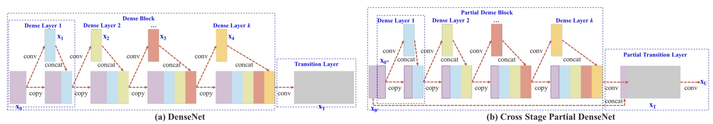

# PyTorch Implementation of # CSP DenseNet (for performance comparison in paper "Neural Network Application for Assessing Thyroid-Associated Orbitopathy Activity using Orbital Computed Tomography")
 
The preprocessing and architecture can be referenced by a manuscript entitled, "CSPNet: A new backbone that can enhance learning capability of CNN." 

## Overview
This repository contains an unofficial implementation of CSP DenseNet using PyTorch.<br/>


## Neural Network Block

## Paper
If you use this software for your research, please cite:

```bibtex
@inproceedings{wang2020cspnet,
  title={CSPNet: A new backbone that can enhance learning capability of CNN},
  author={Wang, Chien-Yao and Liao, Hong-Yuan Mark and Wu, Yueh-Hua and Chen, Ping-Yang and Hsieh, Jun-Wei and Yeh, I-Hau},
  booktitle={Proceedings of the IEEE/CVF conference on computer vision and pattern recognition workshops},
  pages={390--391},
  year={2020}
}
```

## License
This program is available for download for non-commercial use, licensed under the GNU General Public License. This allows its use for research purposes or other free software projects but does not allow its incorporation into any type of commercial software.

## Files
The repository contains the following files:
- `CSP_DenseNet.py`: Python script file, containing the PyTorch implementation of the ConvNeXt
- `CSP_DenseNet.png`: Figure file for network block
- `README.md`: Markdown file explaining the model source code
